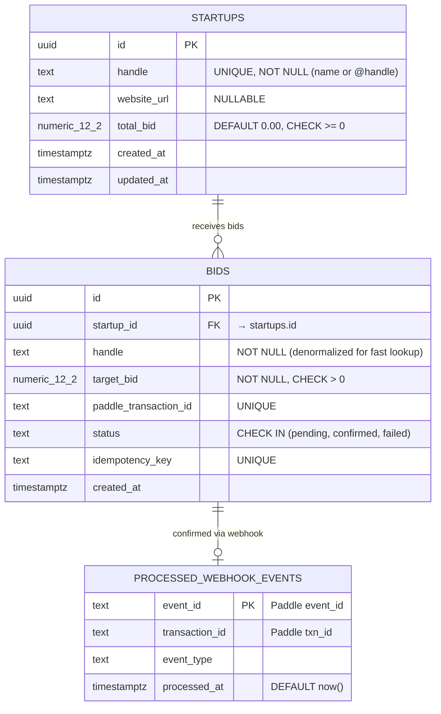

# Data Model: Anonymous Startup Bid Leaderboard

**Feature**: Anonymous Startup Bid Leaderboard
**Date**: 2026-08-23
**Source**: [spec.md](spec.md) Key Entities + [research.md](research.md) R-002, R-003, R-005

---

## Entity Relationship Diagram



---

## Entity Details

### 1. Startups

Core leaderboard entity. Created automatically on first confirmed bid for a new handle via the `confirm_bid_atomic` stored procedure (upsert pattern). No user ownership.

| Column | Type | Constraints | Notes |
|---|---|---|---|
| `id` | `UUID` | PK, DEFAULT `gen_random_uuid()` | |
| `handle` | `TEXT` | UNIQUE, NOT NULL | Startup name or @handle |
| `website_url` | `TEXT` | NULLABLE | Optional startup website |
| `total_bid` | `NUMERIC(12,2)` | DEFAULT 0.00, CHECK >= 0 | Current winning bid amount (replaced on each new bid, not accumulated) |
| `created_at` | `TIMESTAMPTZ` | DEFAULT `now()` | |
| `updated_at` | `TIMESTAMPTZ` | DEFAULT `now()` | Updated on each confirmed bid |

**Indexes**:
- `idx_startups_total_bid_desc` on `(total_bid DESC, updated_at ASC)` — leaderboard query
- `idx_startups_handle` on `(handle)` — handle lookup

**Key behavior**: `total_bid` is REPLACED (not accumulated) on each confirmed bid. If Startup A had $10 and someone bids $15 for it, `total_bid` becomes $15.

---

### 2. Bids

Audit trail for all bid transactions. Each bid is a standalone full-price payment.

| Column | Type | Constraints | Notes |
|---|---|---|---|
| `id` | `UUID` | PK, DEFAULT `gen_random_uuid()` | |
| `startup_id` | `UUID` | FK → `startups(id)`, NULLABLE | NULL for bids on new handles (startup created during confirmation) |
| `handle` | `TEXT` | NOT NULL | Denormalized handle for pre-confirmation lookups |
| `target_bid` | `NUMERIC(12,2)` | NOT NULL, CHECK > 0 | Full price the bidder pays |
| `paddle_transaction_id` | `TEXT` | UNIQUE | Paddle transaction reference |
| `status` | `TEXT` | CHECK IN ('pending', 'confirmed', 'failed') | Payment lifecycle state |
| `idempotency_key` | `TEXT` | UNIQUE | Prevents duplicate bid processing |
| `created_at` | `TIMESTAMPTZ` | DEFAULT `now()` | |

**State Transitions**: `pending` → `confirmed` (on webhook success) or `pending` → `failed` (on webhook failure/timeout).

---

### 3. Processed Webhook Events

Idempotency guard for Paddle webhooks.

| Column | Type | Constraints | Notes |
|---|---|---|---|
| `event_id` | `TEXT` | PK | Paddle `event_id` — natural dedup key |
| `transaction_id` | `TEXT` | | Paddle transaction reference |
| `event_type` | `TEXT` | | e.g., `transaction.completed` |
| `processed_at` | `TIMESTAMPTZ` | DEFAULT `now()` | |

---

## Stored Procedure: `confirm_bid_atomic`

```sql
CREATE OR REPLACE FUNCTION confirm_bid_atomic(
  p_handle TEXT,
  p_website_url TEXT,
  p_target_bid NUMERIC,
  p_paddle_transaction_id TEXT
) RETURNS JSONB AS $$
DECLARE
  v_startup_id UUID;
  v_current_leader_bid NUMERIC;
  v_bid_id UUID;
BEGIN
  -- 1. Get current leader bid
  SELECT total_bid INTO v_current_leader_bid
  FROM startups
  ORDER BY total_bid DESC
  LIMIT 1
  FOR UPDATE;

  -- 2. Validate target exceeds leader
  IF v_current_leader_bid IS NOT NULL AND p_target_bid <= v_current_leader_bid THEN
    RAISE EXCEPTION 'BID_TOO_LOW: Target bid must exceed current leader bid of %', v_current_leader_bid;
  END IF;

  -- 3. Upsert startup (create if new handle, update if existing)
  INSERT INTO startups (handle, website_url, total_bid, updated_at)
  VALUES (p_handle, p_website_url, p_target_bid, now())
  ON CONFLICT (handle) DO UPDATE
  SET total_bid = p_target_bid,
      website_url = COALESCE(EXCLUDED.website_url, startups.website_url),
      updated_at = now()
  RETURNING id INTO v_startup_id;

  -- 4. Update bid record to confirmed
  UPDATE bids
  SET status = 'confirmed', startup_id = v_startup_id
  WHERE paddle_transaction_id = p_paddle_transaction_id
    AND status = 'pending'
  RETURNING id INTO v_bid_id;

  RETURN jsonb_build_object(
    'startup_id', v_startup_id,
    'bid_id', v_bid_id,
    'new_total_bid', p_target_bid,
    'handle', p_handle
  );
END;
$$ LANGUAGE plpgsql SECURITY DEFINER;
```

---

## Removed Entities (from v2.0.0)

The following entities from the previous data model have been **removed** per constitution v3.0.0:

- **Profiles** — No user profiles. Eliminated by Principle XI.
- **Notifications** — No user-specific notification storage. Outbid alerts are ephemeral broadcast events.
- **Auth triggers** (`handle_new_user`) — No auth system. Eliminated by Principle XI.
- **RLS policies referencing `auth.uid()`** — No authenticated users. All reads are public.
